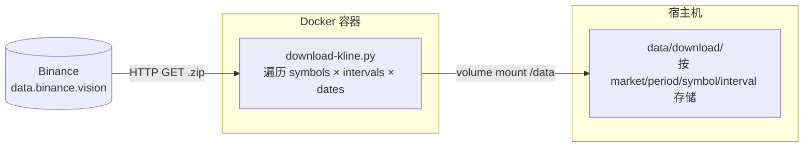

# downloader

从 [Binance Public Data](https://data.binance.vision/) 批量下载历史 K 线数据，支持现货（spot）、U 本位合约（um）、币本位合约（cm）。

## 架构概览



## 数据下载流程

```
1. 解析命令行参数（交易类型、标的、周期、日期范围等）
2. 如未指定 -s，从 Binance API 获取该交易类型下的所有交易对
3. 根据交易类型确定默认起始日期（spot: 2017, um: 2020, cm: 2020）
4. 月度下载：排除当前未完成月份，遍历 years × months
5. 日度下载：从 startDate 到今天生成日期列表
6. 对每个 symbol × interval 组合：
   a. 扫描本地目录，获取已有文件集合
   b. 跳过已存在的文件（增量下载）
   c. 对缺失文件发起 HTTP 下载
7. 下载的 zip 文件存储到 /data（映射到宿主机 data/download/）
```

## 数据存储结构

```
data/download/
└── data/
    ├── spot/                        # 现货
    │   ├── monthly/klines/{SYMBOL}/{interval}/
    │   │   └── {SYMBOL}-{interval}-{YYYY}-{MM}.zip
    │   └── daily/klines/{SYMBOL}/{interval}/
    │       └── {SYMBOL}-{interval}-{YYYY-MM-DD}.zip
    └── futures/
        ├── um/                      # U 本位合约
        │   ├── monthly/klines/...
        │   └── daily/klines/...
        └── cm/                      # 币本位合约
            ├── monthly/klines/...
            └── daily/klines/...
```

## 快速开始

### 构建镜像

```bash
docker compose -f docker/downloader/compose.yml build
```

### 查看帮助

```bash
docker compose -f docker/downloader/compose.yml run --rm downloader --help
```

## 常用命令

### 下载 U 本位合约月度数据

```bash
# 下载所有 U 本位交易对的 1h 月度 K 线（跳过日度）
docker compose -f docker/downloader/compose.yml run --rm downloader \
  -t um -i 1h -skip-daily 1

# 只下载指定交易对
docker compose -f docker/downloader/compose.yml run --rm downloader \
  -t um -s BTCUSDT ETHUSDT -i 1h -skip-daily 1
```

### 下载 U 本位合约日度数据

```bash
# 下载所有 U 本位交易对的 1h 日度 K 线（跳过月度）
docker compose -f docker/downloader/compose.yml run --rm downloader \
  -t um -i 1h -skip-monthly 1

# 从指定日期开始下载
docker compose -f docker/downloader/compose.yml run --rm downloader \
  -t um -i 1h -skip-monthly 1 -startDate 2026-01-01
```

### 下载现货数据

```bash
docker compose -f docker/downloader/compose.yml run --rm downloader \
  -t spot -s BTCUSDT -i 1d
```

### 下载多个周期

```bash
docker compose -f docker/downloader/compose.yml run --rm downloader \
  -t um -s BTCUSDT -i 1h 4h 1d -skip-daily 1
```

## 参数说明

| 参数 | 说明 | 默认值 |
|------|------|--------|
| `-t` | **必填**。交易类型：`spot`、`um`、`cm` | - |
| `-s` | 交易对，多个用空格分隔 | 全部交易对 |
| `-i` | K 线周期，多个用空格分隔 | 全部周期 |
| `-y` | 年份，多个用空格分隔 | 2017 至当前年份 |
| `-m` | 月份（1-12），多个用空格分隔 | 1-12 |
| `-d` | 指定日期（YYYY-MM-DD），多个用空格分隔 | 自动生成 |
| `-startDate` | 起始日期（YYYY-MM-DD） | 按交易类型自动确定 |
| `-endDate` | 结束日期（YYYY-MM-DD） | 今天 |
| `-skip-monthly` | 设为 `1` 跳过月度下载 | `0` |
| `-skip-daily` | 设为 `1` 跳过日度下载 | `0` |
| `-c` | 设为 `1` 同时下载 checksum 文件 | `0` |

## 默认起始日期

不指定 `-startDate` 时，根据交易类型自动确定起始日期：

| 交易类型 | 默认起始日期 | 说明 |
|---------|------------|------|
| `spot` | 2017-01-01 | Binance 现货最早数据 |
| `um` | 2020-01-01 | U 本位合约最早月度归档 |
| `cm` | 2020-01-01 | 币本位合约最早月度归档 |

## 增量下载机制

脚本内置增量下载逻辑，重复运行不会重新下载已有数据：

1. **本地文件扫描**：每个 symbol + interval 组合，先扫描本地目录获取已有文件集合
2. **Set 查找跳过**：循环中用 O(1) 集合查找跳过已存在的文件，不发起任何网络请求
3. **汇总日志**：跳过的文件只输出一行汇总（如 `Skipped 73 already downloaded files for BTCUSDT/1h`）

因此可以放心地重复运行同一命令，脚本会自动从上次中断的位置继续。

## 月度下载说明

- 月度归档只包含**已完成**的月份，当月数据需等月底 Binance 打包后才可下载
- 脚本会自动排除当前未完成月份，避免无效请求
- 月度数据和日度数据互补：月度覆盖历史大范围，日度覆盖最近未打包的天数

## 更新镜像

代码更新后需重新构建 Docker 镜像：

```bash
# 拉取最新代码
git pull --recurse-submodules

# 重新构建（--build 可与 run 合用）
docker compose -f docker/downloader/compose.yml run --rm --build downloader \
  -t um -i 1h -skip-daily 1
```

## 文件结构

```
binance-public-data/python/
├── download-kline.py    # 主入口，K 线下载编排
├── enums.py             # 常量配置（年份、周期、交易类型、默认起始日期）
├── utility.py           # 工具函数（HTTP 下载、参数解析、路径生成）
└── requirements.txt     # Python 依赖

docker/downloader/
├── Dockerfile           # 容器镜像（Python 3.13 + uv）
├── compose.yml          # Docker Compose 编排
└── README.md            # 本文档
```
