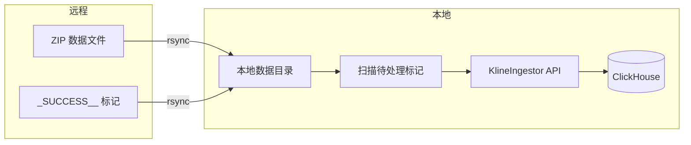

# sync

从远程服务器同步 Binance kline 数据到本地，并自动 ingest 入 ClickHouse。

## 工作流程



## 前置条件

- 已配置到远程服务器的 SSH 免密登录（`ssh cryptodata` 可直接连接）
- 本地 ClickHouse 已启动
- Docker 已安装

## 配置

编辑 `sync/config.yaml`：

```yaml
remote:
  host: cryptodata                  # SSH 主机名
  data_dir: /data/zer0data/download # 远程数据目录

local:
  data_dir: /data/zer0data/download       # 本地数据目录
  state_dir: /data/zer0data/download/_ingested  # 已 ingest 状态记录
  log_dir: /data/zer0data/logs            # 日志目录
  project_root: /Users/rock/work/zer0data

clickhouse:
  host: localhost
  port: 8123
  database: zer0data
```

Docker 运行时会通过环境变量覆盖 `local.*` 和 `clickhouse.*` 的路径，无需手动修改。

支持的环境变量覆盖：

| 环境变量 | 覆盖字段 |
|---------|---------|
| `REMOTE_HOST` | `remote.host` |
| `REMOTE_DATA_DIR` | `remote.data_dir` |
| `LOCAL_DATA_DIR` | `local.data_dir` |
| `LOCAL_STATE_DIR` | `local.state_dir` |
| `LOCAL_LOG_DIR` | `local.log_dir` |
| `CLICKHOUSE_HOST` | `clickhouse.host` |
| `CLICKHOUSE_PORT` | `clickhouse.port` |
| `CLICKHOUSE_DB` | `clickhouse.database` |

## 使用（Docker）

### 构建镜像

```bash
docker compose -f docker/sync/compose.yml build
```

### 日常增量同步（rsync + ingest）

```bash
docker compose -f docker/sync/compose.yml run --rm sync
```

### 初次大批量同步

数据量较大时（10-100GB），建议分两步进行：

```bash
# 第一步：仅传输数据，不 ingest（支持断点续传，可限速）
docker compose -f docker/sync/compose.yml run --rm sync --no-ingest --bwlimit 10000

# 第二步：数据传完后，运行 ingest
docker compose -f docker/sync/compose.yml run --rm sync
```

### 预览同步内容

```bash
docker compose -f docker/sync/compose.yml run --rm sync --dry-run
```

### 完整参数

| 参数 | 说明 |
|------|------|
| `--config PATH` | 指定配置文件路径（默认自动查找同目录 config.yaml） |
| `--no-ingest` | 仅 rsync 同步，跳过 ingest |
| `--dry-run` | 预览 rsync 将传输的内容，不实际执行 |
| `--bwlimit KB/s` | rsync 带宽限制（单位：KB/s） |

## Docker 配置说明

`docker/sync/compose.yml` 挂载了以下卷：

| 容器路径 | 宿主机路径 | 说明 |
|---------|-----------|------|
| `/data` | `data/download` | 数据目录（rsync 目标 + ingest 源） |
| `/logs` | `data/logs` | 日志输出 |
| `/root/.ssh` | `~/.ssh`（只读） | SSH 密钥（rsync 需要） |

ClickHouse 通过 `host.docker.internal` 连接宿主机。

## 文件说明

| 文件 | 说明 |
|------|------|
| `sync/sync.py` | 主入口，rsync 同步 + ingest 编排 |
| `sync/config.py` | YAML 配置加载 + 环境变量覆盖 |
| `sync/config.yaml` | 配置文件 |
| `sync/state.py` | `_SUCCESS__` 标记解析与 `_ingested/` 状态追踪 |
| `docker/sync/Dockerfile` | 容器镜像（rsync + SSH + Python 依赖） |
| `docker/sync/compose.yml` | Docker Compose 编排 |

## 状态追踪机制

远程下载完成后会在数据目录创建标记文件：

```
_SUCCESS__2026-02-14__um__1h    # 表示 2026-02-14 的 um 市场 1h 数据已下载完成
```

sync 模块会：

1. rsync 将标记文件同步到本地
2. 扫描所有 `_SUCCESS__*` 标记
3. 对比 `_ingested/` 目录，跳过已处理的标记
4. 对每个未处理的标记，用对应的 glob pattern（如 `**/*-1h-2026-02-14.zip`）调用 `KlineIngestor`
5. ingest 成功后在 `_ingested/` 中创建同名文件，标记为已处理

## 并发安全

脚本使用文件锁（`fcntl.flock`）确保同一时间只有一个 sync 进程运行，防止定时任务重叠。

## 日志

日志同时输出到 stderr 和文件：

```
/logs/sync_2026-02-15.log
```
