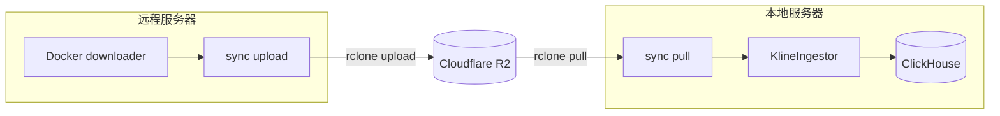

# sync

通过 Cloudflare R2 对象存储在远程服务器和本地服务器之间同步 Binance kline 数据，并自动 ingest 入 ClickHouse。

## 工作流程



## 前置条件

- Docker 已安装
- Cloudflare R2 bucket 已创建
- R2 API Token 已获取（access_key_id + secret_access_key）
- 本地 ClickHouse 已启动（仅 pull + ingest 需要）

## 配置

### 1. 创建 `.env` 文件

在项目根目录创建 `.env`（参考 `.env.example`）：

```bash
R2_ACCESS_KEY_ID=your_access_key_id
R2_SECRET_ACCESS_KEY=your_secret_access_key
R2_ENDPOINT=https://your_account_id.r2.cloudflarestorage.com
```

### 2. 编辑 `sync/config.yaml`

```yaml
storage:
  type: r2
  r2:
    bucket: zer0data      # R2 bucket 名称
    prefix: download      # bucket 内路径前缀
    transfers: 8          # 并行传输线程数
```

R2 凭证通过 `.env` 文件注入，不写在 config.yaml 中。

## 使用（Docker）

### 构建镜像

```bash
docker compose -f docker/sync/compose.yml build
```

### 远程服务器：下载 + 上传到 R2

```bash
# 第一步：下载数据（和以前一样）
docker compose -f docker/downloader/compose.yml run --rm downloader \
  -t um -s BTCUSDT -i 1h -d 2026-02-14

# 第二步：上传到 R2
docker compose -f docker/sync/compose.yml run --rm sync upload

# 上传并清理本地 zip 文件（节省磁盘）
docker compose -f docker/sync/compose.yml run --rm sync upload --cleanup

# 预览上传内容
docker compose -f docker/sync/compose.yml run --rm sync upload --dry-run
```

### 本地服务器：从 R2 拉取 + ingest

```bash
# 拉取 + ingest
docker compose -f docker/sync/compose.yml run --rm sync pull

# 仅拉取，不 ingest
docker compose -f docker/sync/compose.yml run --rm sync pull --no-ingest

# 预览拉取内容
docker compose -f docker/sync/compose.yml run --rm sync pull --dry-run
```

### 完整参数

**upload 子命令（远程服务器用）：**

| 参数 | 说明 |
|------|------|
| `--dry-run` | 预览上传内容，不实际传输 |
| `--cleanup` | 上传成功后删除本地 zip 文件 |

**pull 子命令（本地服务器用）：**

| 参数 | 说明 |
|------|------|
| `--no-ingest` | 仅拉取数据，跳过 ingest |
| `--dry-run` | 预览拉取内容，不实际传输 |
| `--bwlimit KB/s` | rsync 带宽限制（仅 rsync 模式） |

**通用参数：**

| 参数 | 说明 |
|------|------|
| `--config PATH` | 指定 config.yaml 路径 |

## 为什么用 R2

适用于远程服务器和本地服务器距离很远（如跨洲）的场景：

- **无出站费用**：R2 下载免费
- **全球边缘网络**：Cloudflare CDN 加速，比 rsync 直连快很多
- **多线程并行传输**：rclone 支持 `--transfers` 并行
- **解耦**：远程上传和本地下载互不依赖，不需要同时在线

## rsync 备选

如果两台服务器距离较近，可以在 `config.yaml` 中切换为 rsync 模式：

```yaml
storage:
  type: rsync
```

## Docker 配置说明

`docker/sync/compose.yml` 挂载的卷：

| 容器路径 | 宿主机路径 | 说明 |
|---------|-----------|------|
| `/data` | `data/download` | 数据目录 |
| `/logs` | `data/logs` | 日志输出 |
| `/root/.ssh` | `~/.ssh`（只读） | SSH 密钥（rsync 模式需要） |

R2 凭证通过 `.env` → compose.yml environment → rclone 环境变量注入。

## 文件说明

| 文件 | 说明 |
|------|------|
| `sync/sync.py` | 主入口，pull / upload 子命令 |
| `sync/transfer.py` | 传输层：rclone R2 upload/pull + rsync fallback |
| `sync/config.py` | YAML 配置加载 + 环境变量覆盖 |
| `sync/config.yaml` | 配置文件 |
| `sync/state.py` | `_SUCCESS__` 标记解析与 `_ingested/` 状态追踪 |
| `docker/sync/Dockerfile` | 容器镜像（rclone + rsync + Python） |
| `docker/sync/compose.yml` | Docker Compose 编排 |

## 状态追踪机制

远程下载完成后会在数据目录创建标记文件：

```
_SUCCESS__2026-02-14__um__1h
```

sync pull 会：

1. 从 R2 拉取数据和标记文件到本地
2. 扫描所有 `_SUCCESS__*` 标记
3. 对比 `_ingested/` 目录，跳过已处理的
4. 调用 `KlineIngestor` 处理对应的 ZIP 文件
5. 成功后标记为已处理

## 并发安全

文件锁（`fcntl.flock`）确保同一时间只有一个 sync 进程运行。

## 日志

日志同时输出到 stderr 和文件 `/logs/sync_YYYY-MM-DD.log`。
