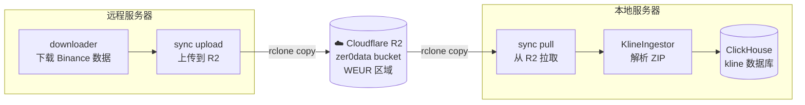

# sync

通过 Cloudflare R2 对象存储在远程服务器和本地服务器之间同步 Binance kline 数据，并自动 ingest 入 ClickHouse。

## 架构概览



## 快速开始

### 第一步：创建 R2 Bucket

1. 登录 [Cloudflare Dashboard](https://dash.cloudflare.com) → R2 Object Storage
2. 点击 **Create bucket**，名称填 `zer0data`，区域选离数据下载服务器最近的区域（如服务器在亚太选 **APAC**，在美东选 **ENAM**，在欧洲选 **WEUR**）
3. 进入 **Manage R2 API Tokens** → **Create Account API token**
   - 权限：**Object Read & Write**
   - 范围：**Apply to specific buckets only** → `zer0data`
4. 复制保存 **Access Key ID**、**Secret Access Key**、**Endpoint URL**（只显示一次）

### 第二步：配置 `.env`

在**两台服务器**的项目根目录创建 `.env`：

```bash
cp .env.example .env
```

填入 R2 凭证：

```bash
# Cloudflare R2
R2_ACCESS_KEY_ID=你的_access_key_id
R2_SECRET_ACCESS_KEY=你的_secret_access_key
R2_ENDPOINT=https://你的_account_id.r2.cloudflarestorage.com
```

> **注意**：`R2_ENDPOINT` 中的是 Cloudflare **Account ID**，不是 bucket 名称。在 R2 概览页右侧可以复制。

### 第三步：构建 Docker 镜像

在两台服务器上分别执行：

```bash
docker compose -f docker/sync/compose.yml build
```

### 第四步：远程服务器上传数据

```bash
# 预览要上传的文件（不实际传输）
docker compose -f docker/sync/compose.yml run --rm sync upload --dry-run

# 正式上传
docker compose -f docker/sync/compose.yml run --rm sync upload

# 上传后清理本地 zip（节省磁盘）
docker compose -f docker/sync/compose.yml run --rm sync upload --cleanup
```

### 第五步：本地服务器拉取数据

```bash
# 预览要拉取的文件
docker compose -f docker/sync/compose.yml run --rm sync pull --dry-run

# 仅拉取数据，不 ingest（推荐首次大批量同步时用）
docker compose -f docker/sync/compose.yml run --rm sync pull --no-ingest

# 拉取 + 自动 ingest 到 ClickHouse
docker compose -f docker/sync/compose.yml run --rm sync pull
```

## 日常增量同步

数据下载完成后，只需在两端各跑一条命令：

```bash
# 远程服务器：上传新数据
docker compose -f docker/sync/compose.yml run --rm sync upload

# 本地服务器：拉取 + ingest
docker compose -f docker/sync/compose.yml run --rm sync pull
```

rclone 会自动跳过已同步的文件（基于 checksum 校验），只传输新增/变更的文件。

## 断点续传

- **文件级别**：支持。中断后重新运行同样的命令，已完整传输的文件会自动跳过。
- **单文件内部**：大文件传输中断后会从头重传（非分片续传），但 rclone 配置了 `--retries=3` 自动重试。

## 命令参考

### upload（远程服务器用）

```
python sync.py upload [--dry-run] [--cleanup]
```

| 参数 | 说明 |
|------|------|
| `--dry-run` | 预览上传内容，不实际传输 |
| `--cleanup` | 上传成功后删除本地 zip 文件 |

### pull（本地服务器用）

```
python sync.py pull [--dry-run] [--no-ingest] [--bwlimit KB/s]
```

| 参数 | 说明 |
|------|------|
| `--dry-run` | 预览拉取内容，不实际传输 |
| `--no-ingest` | 仅拉取数据，跳过 ClickHouse 入库 |
| `--bwlimit KB/s` | 带宽限制（仅 rsync 模式） |

### 通用参数

| 参数 | 说明 |
|------|------|
| `--config PATH` | 指定 config.yaml 路径（默认自动查找） |

## 配置说明

### config.yaml

```yaml
storage:
  type: r2                # r2 或 rsync
  r2:
    bucket: zer0data      # R2 bucket 名称
    prefix: download      # bucket 内路径前缀
    transfers: 8          # rclone 并行传输线程数

download:
  symbols: [BTCUSDT, ETHUSDT, SOLUSDT, BNBUSDT]
  intervals: [1m, 5m, 15m, 1h, 4h, 1d]
  market: um
```

### 环境变量覆盖

Docker 运行时通过环境变量覆盖 config.yaml 中的值：

| 环境变量 | 覆盖字段 | 来源 |
|---------|---------|------|
| `R2_ACCESS_KEY_ID` | R2 凭证 | `.env` |
| `R2_SECRET_ACCESS_KEY` | R2 凭证 | `.env` |
| `R2_ENDPOINT` | R2 端点 | `.env` |
| `LOCAL_DATA_DIR` | `local.data_dir` | compose.yml |
| `LOCAL_STATE_DIR` | `local.state_dir` | compose.yml |
| `LOCAL_LOG_DIR` | `local.log_dir` | compose.yml |
| `CLICKHOUSE_HOST` | `clickhouse.host` | compose.yml |
| `CLICKHOUSE_PORT` | `clickhouse.port` | compose.yml |
| `CLICKHOUSE_DB` | `clickhouse.database` | compose.yml |

R2 凭证在 `.env` 中配置，由 `entrypoint.sh` 自动映射为 rclone 所需的 `RCLONE_CONFIG_R2_*` 环境变量。

## 为什么选 R2

| 特性 | R2 | rsync 直连 |
|------|-----|-----------|
| 出站流量费 | 免费 | N/A |
| 跨洲传输速度 | 快（Cloudflare CDN） | 慢（单连接） |
| 并行传输 | 支持（`--transfers`） | 不支持 |
| 两端解耦 | 是（不需同时在线） | 否（需要 SSH 直连） |
| 免费额度 | 10GB 存储 / 月 | N/A |
| 超出费用 | $0.015/GB/月 存储，下载免费 | N/A |

如果两台服务器距离较近，可在 `config.yaml` 中切换为 rsync：

```yaml
storage:
  type: rsync
```

## 状态追踪与 Ingest 机制

远程 downloader 完成后会创建标记文件：

```
_SUCCESS__2026-02-14__um__1h    # 表示 2026-02-14 的 um 市场 1h 数据已下载完成
```

`sync pull` 流程：

1. 从 R2 拉取所有数据文件和标记文件到本地
2. 扫描所有 `_SUCCESS__*` 标记
3. 对比 `_ingested/` 目录，跳过已处理的标记
4. 对未处理的标记，用对应 glob pattern（如 `**/*-1h-2026-02-14.zip`）调用 `KlineIngestor`
5. ingest 成功后在 `_ingested/` 创建同名文件，标记为已处理

## 文件结构

```
sync/
├── sync.py          # 主入口，pull / upload 子命令编排
├── transfer.py      # 传输层：rclone R2 upload/pull + rsync fallback
├── config.py        # YAML 配置加载 + 环境变量覆盖
├── config.yaml      # 配置文件
└── state.py         # _SUCCESS__ 标记解析与 _ingested/ 状态追踪

docker/sync/
├── Dockerfile       # 容器镜像（Python + rclone + rsync）
├── compose.yml      # Docker Compose 编排
└── entrypoint.sh    # 入口脚本（SSH 权限修复 + R2 环境变量映射）
```

## 并发安全

文件锁（`fcntl.flock`）确保同一时间只有一个 sync 进程运行，防止定时任务重叠。

## 日志

日志同时输出到 stderr 和文件：

```
/logs/sync_YYYY-MM-DD.log
```

## 故障排除

| 问题 | 原因 | 解决 |
|------|------|------|
| `NoSuchBucket` | bucket 名称或 endpoint 配置错误 | 检查 `.env` 中 `R2_ENDPOINT` 格式和 `config.yaml` 中 bucket 名称 |
| `RCLONE_CONFIG_R2_ENDPOINT` 为空 | `.env` 未被正确加载 | 确认 `.env` 在项目根目录，内容格式正确 |
| Docker build 卡住 / 磁盘满 | 构建上下文包含了数据目录 | 确认 `.dockerignore` 存在且包含 `data/` |
| `Another sync process is already running` | 上次进程未正常退出 | 删除 `_ingested/.sync.lock` 文件 |
